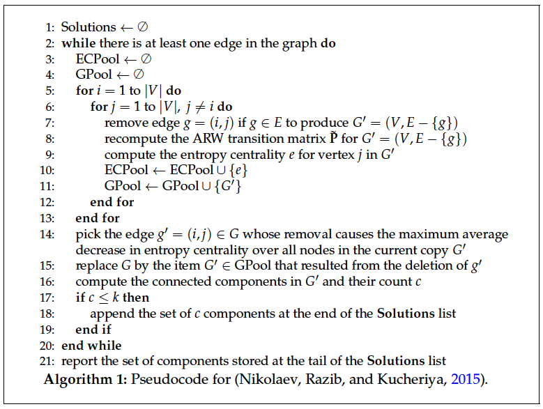

# Entropy centrality-based community detection
This repository offers a MATLAB / GNU Octave implementation of the research article by (Nikolaev, Razib and Kucheriya, 2015) titled "On efficient use of entropy centrality for social network analysis and community detection" that was published in the Elsevier Social Networks journal in 2015. The source code available here is a third-party implementation of the method presented by (Nikolaev, Razib and Kucheriya, 2015) and not the actual implementation used by the authors in their study.

**If you actually need to use the implementation used by authors of the abovementioned study in order to generate community assignment data or other data (such as entropy centrality values), then you should not use the source code available here!**

# Entropy centrality-based community detection using an absorbing random walk
The algorithm of (Nikolaev, Razib and Kutcheriya, 2015) is summarized in the following graphic. This graphic is generated from the thesis manuscript of the author of this repository and is available at https://ikee.lib.auth.gr/record/330591. You are suggested to download the thesis from this URL and attend to the text regarding this method. In the thesis, you can also read the experiments that I run using this implementation.



# Folder structure
This repository contains 4 main folders, each serving a particular aim. The "ECCD" folder contains the MATLAB source code implementing the community detection method. The "data" folder contains several directed graphs which can be used to evaluate community structure. The "modularity_calculation"  folder contains MATLAB scripts which can be used to calculate the Newman modularities of the sequence of community assignments for several values of the community count. The "plotter_scripts" folder contains MATLAB scripts which can be used to graphically visualize the modularity sequences of a particular graph (in fact, one of the available ones), possibly allowing for the plotting of the $t$ parameter (please read the paper for more on the $t$ parameter).

# How to evaluate the method
The prototype of the ECCD function (see the "ECCD/" folder) is [communities,edges_exhausted] = ECCD(A,a,t,k,debug,use_sp_matrix). The parameter $A$ is the orthogonal adjacency matrix of a graph (an undirected or a directed one). $a$ is the probability of halting the absorbing random walk. $t$ is the community analysis resolution parameter. $debug$ is an integer flag expecting the value 0 or 1; if it is set to 1, then debug messages appear after invoking the ECCD function. "use_sp_matrix" is an important parameter. You should set it to 1 if $A$ is a large adjacency matrix, and you may set it to 0 if the adjacency matrix $A$ is small.

# Calculation of connected components
Our suggestions on the calculation of connected components in the implementation of the ECCD function regards the specific platform that you use to evaluate the code. We consider the open source GNU Octave software and the Mathworks MATLAB environment. In either case, you are suggested to do

```
$ git clone https://github.com/brigr/entropycentrality-community-detection
$ cd entropycentrality-community-detection/
```

Then start MATLAB from your command line prompt using
```
$ matlab
```

or start GNU Octave using the command line
```
$ octave
```

Once MATLAB or GNU Octave opens, execute the following commands to prepare the connected components calculation function that is based on MEX.

```
>> addpath(genpath('.'))
>> mex -O -largeArrayDims graph_conn_comp_mex.cpp
```

# Invoking the function in ECCD.m

Here we show an example of how to invoke the ECCD function (implemented in ECCD.m in the ECCD folder). We assume that you already run

```
>> addpath(genpath('.'))
```

from your GNU Octave or MATLAB environment. To invoke ECCD, you should first load an adjacency matrix either from one file that you prepared or from one of the files available in the ```data/``` folder.

```
>> A = load('data/KAPFMM.txt'); % load the KAPFMM graph
>> [communities,edges_exhausted] = ECCD(A,0.1,2,2,1,1);
>> communities % print communities
>> edges_exhausted % learn if the algorithm terminated prematurely
```

# Important notices
Note that this is a third-party implementation of the research article by (Nikolaev, Razib and Kutcheriya, 2015). We have verified that the code works on both MATLAB and on GNU Octave (please be careful on the connected component function call which is different for these two platforms). We have verified that the implementation works as expected for the graphs that are evaluated in the experiment section of the paper. You should make sure that the latter fact applies for your installation of the code in the environment that you try it on. If you spot any other problem with the code, you can contact me at s.karavarsamis@gmail.com.

This notice is to also make you aware of the fact that this is a third-party implementation and not the implementation that (Nikolaev, Razib and Kutcheriya, 2015) used to prepare their study. However, as the instructions of the algorithm are exact, you should expect to receive identical results with the results that would be computed by the authors' implementation when you use this implementation.
